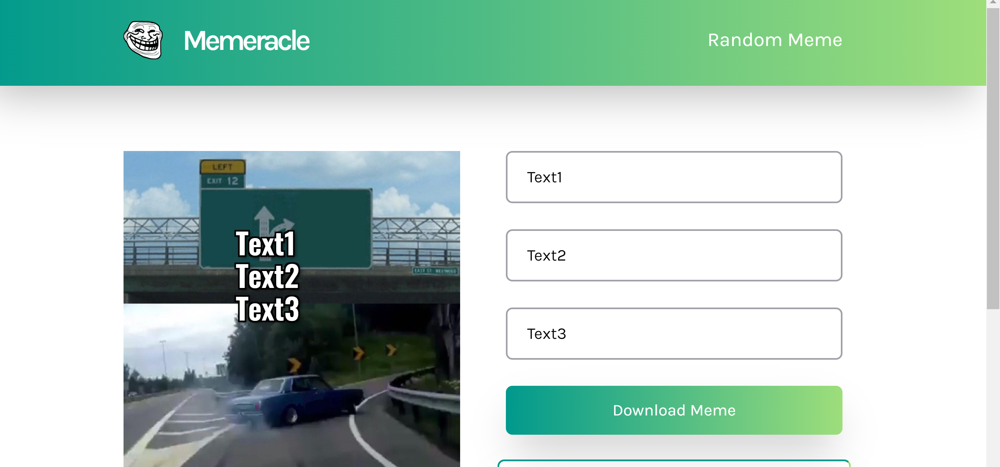

## Memeracle - Make your own memes

Memeracle is an open source, react-built, meme generator.

You can check it out here 👇

Live site - [Click here](https://memeracle.vercel.app)

## Installation

To install and run this project locally follow these steps:

1. Fork and clone this repo
2. Run `npm install` from within the repo's directory
3. Run `npm start`

This should start the dev server in your browser. If you're having any environment issues during installation open an issue describing the problem.

## Examples

Here are some screenshot examples of the app

## Contribution

You need 0 coding knowledge to contribute to the project! Some good ideas for first issues are updating documentation, suggesting some design improvements, making PR templates and so much more!

Just raise an [issue](https://github.com/Dharmik48/meme-generator/issues/new) for it

<!-- Please read CONTRIBUTING for a full guide to contributing to this project. -->
